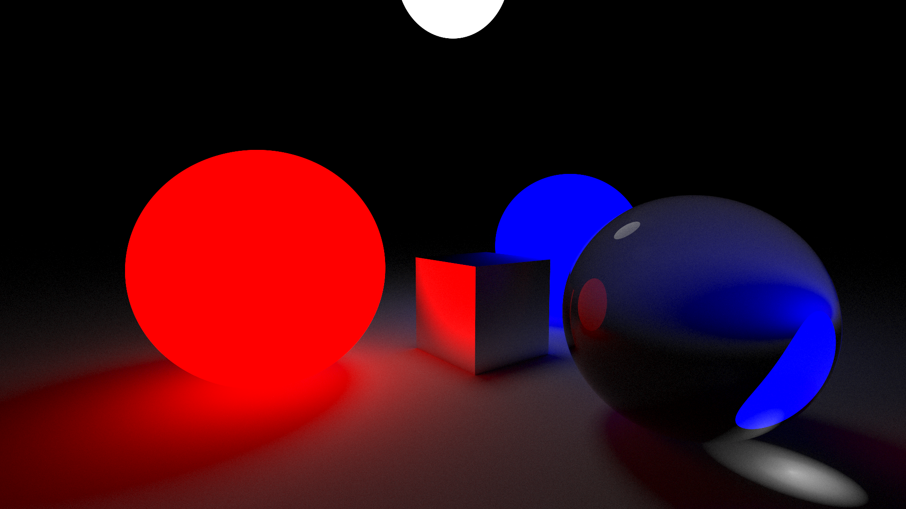
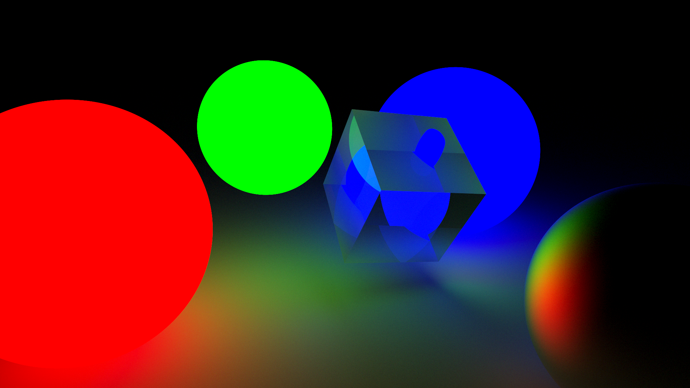

# Ray Tracing Renderer
---
A physically based ray tracing renderer implemented in C++. This project implements core concepts of ray tracing including reflection, refraction, and global illumination.


## Features
---
### Materials
- **Dielectric** - Simulates transparent materials like glass with:
  - Fresnel reflectance (Schlick approximation)
  - Total internal reflection
  - Variable refractive indices
- **Metal** - Reflective materials with:
  - Configurable fuzziness for roughness
  - Energy conservation
- **Lambertian** - Diffuse materials with:
  - Perfect diffuse reflection
  - Matte surface simulation
- **Light** - Emissive materials that:
  - Act as light sources
  - Support different colors

### Geometry
- **Sphere** - Perfect spherical objects with:
  - Accurate normal calculation
  - Ray-sphere intersection
- **Cube** - Box-shaped objects supporting:
  - Six-sided geometry
  - Ray-box intersection

### Core Features
- **Camera System**
  - Configurable field of view
  - Adjustable aspect ratio
  - Look-at functionality
- **Global Illumination**
  - Monte Carlo path tracing
  - Soft shadows
  - Color bleeding
- **Anti-aliasing**
  - Multi-sample anti-aliasing
  - Configurable sample count
- **Sky System**
  - Pluggable sky backgrounds
  - Basic sky gradient
  - Black sky for indoor scenes


## Example
---


*A scene featuring glass sphere, metal cube, and various light sources*


*A scene featuring metal sphere, glass cube, and various light sources*

## Technical Details
---
### Rendering Pipeline
1. Ray Generation
2. Scene Intersection
3. Material Evaluation
4. Light Transport
5. Tone Mapping

### Performance Features
- Early ray termination
- Russian roulette path termination
- Progress monitoring
- Exposure control

## Usage
---

```cpp
// Create materials
material *glass = new dielectric(1.5);
material *metal = new metal(vec3(0.8, 0.8, 0.8), 0.5);

// Set up scene
object *list[2];
list[0] = new sphere(vec3(0, 0, 0), 0.5, glass);
list[1] = new cube(vec3(-1, -1, -1), vec3(1, 1, 1), metal);

// Configure camera
vec3 lookfrom(-2, 2, 1);
vec3 lookat(0, 0, 0);
camera cam(lookfrom, lookat, 60, 16.0/9.0);

// Render
renderer.render(cam, &world, output, height, width, depth, samples, exposure);
```

## Build Instructions
---
### Prerequisites
- C++ compiler with C++11 support
- Basic math library
- Image processing tools for output conversion

### Compilation
```bash
g++ render.cpp -o raytracer -O3 -std=c++11
```

### Running
```bash
./raytracer
convert out.ppm out.png  # Convert to PNG format
```

## Implementation Details
---
### Ray-Object Intersection
- Analytical solution for spheres
- AABB intersection for cubes
- Surface normal computation

### Material System
- BRDF implementation
- Fresnel equations
- Microfacet theory basics

### Monte Carlo Integration
- Importance sampling
- Path tracing
- Random number generation

## Future Improvements
- [ ] Texture mapping support
- [ ] More primitive shapes
- [ ] Parallel rendering
- [ ] Motion blur
- [ ] Depth of field
- [ ] Volumetric rendering

## Contributing
Feel free to open issues or submit pull requests for:
- Bug fixes
- Performance improvements
- New features
- Documentation improvements

## License
[](https://opensource.org/licenses/MIT)

This project is licensed under the MIT License - see the [LICENSE](LICENSE) file for details.
